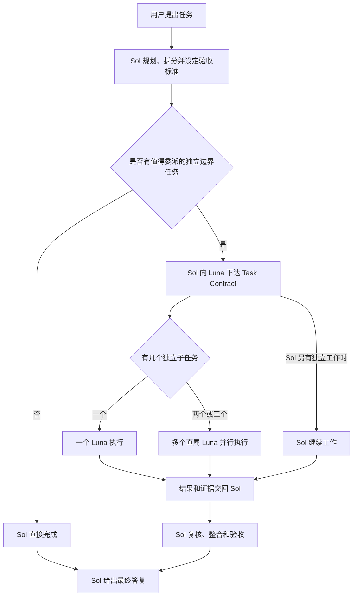

# Codex Sol + Luna Worker

让 GPT-5.6 Sol 专注于规划与验收，让原生 GPT-5.6 Luna worker 承担边界清楚的执行任务。

[English](README.md)

[](https://github.com/SuperDaddyV/codex-sol-luna-worker/releases/tag/v4.1.4)
[](https://github.com/SuperDaddyV/codex-sol-luna-worker/actions/workflows/validate.yml)
[](LICENSE)

> [!IMPORTANT]
> 这是独立的社区项目，与 OpenAI、ModelDial 均无隶属、赞助或背书关系。

## 这是什么

Codex Sol + Luna Worker 在 Codex 中建立清晰的职责分工：

- **Sol 负责规划与验收。** Sol 负责需求、架构、编排、歧义处理和最终答复。
- **Luna 负责边界明确的执行。** Luna 承担范围清楚的实现、定向检查、测试、构建和重复性任务，然后把证据交回 Sol。

Sol 始终掌握控制权：它判断任务是否适合委派，并在验收前复核每一份 Luna 结果。

## Sol 与 Luna 如何协作

Luna 不会接管整个任务。Sol 始终负责理解目标、拆分工作、处理歧义、设定验收标准和给出最终答复。Luna 只接收范围清楚的执行子任务，然后把结果和证据交回 Sol。



- **并行：** 当工作真正互不依赖时，Sol 和 Luna 可以同时工作，最多可同时运行三个直属 Luna。
- **串行：** 如果后一步依赖前一步，Sol 会等待所需结果，再继续或启动下一个 worker。
- **Sol-only：** 任务过小、核心是架构或判断、需求尚有歧义，或无法安全拆分时，由 Sol 直接完成。

以下情况更可能使用 Luna：

- 工作量足以抵消委派开销；
- 子任务有清楚的目标、范围、约束、验收标准和验证方法；
- 实现、定向检查、测试、构建或重复性工作可以安全分离；
- 当天有效的 Daily Luna role 可用。

存在依赖或重叠修改时，仍可能串行委派，但不会并行执行。简单问答、少量读取、一行修改、架构决策和最终评定通常由 Sol 完成。

没有必须使用的“魔法关键词”。提示词中的独立范围越清楚，越有可能委派；是否委派仍由 Sol 判断。

Daily Selector 决定的是“**今天使用哪一档 Luna effort**”，不是“**当前任务是否必须委派**”。它会从 `low`、`medium`、`high`、`xhigh` 和 `max` 中选择；Luna 永远不使用 `ultra`。

Sol 和 Luna 共享当前工作区，因此 Sol 会避免让多个 writer 并行修改重叠文件。每个 Luna 都是 native leaf：它不能继续创建子代理，最终复核始终属于 Sol。

对于非简单任务，最后一行会说明本次执行方式：

```text
Sol/Luna: delegated · luna_high ×2 · parallel
Sol/Luna: Sol-only · task too small
Sol/Luna: Sol-only · no independent bounded work
```

## 核心价值

- **原生 Agent：** 使用 Codex custom agents 和 subagents，不需要 Hook Router 或自建编排引擎。
- **自动 Daily Luna：** 按北京时间每天从五档 Luna effort 中选择一个；日常提示词无需指定 role 或 effort。
- **配置保护和可恢复：** 保留无关用户配置，遇到冲突 fail closed，并通过事务备份支持受控回滚和安全卸载。

## 系统要求

- Codex Desktop，或其他支持 custom agent 与 subagent 的当前 Codex 客户端。
- 当前任务环境可执行 `codex` 命令；如果 `codex --version` 不能运行，仅安装 Codex Desktop 还不够。
- 账号可使用 GPT-5.6 Sol，以及所需五档 effort 的 GPT-5.6 Luna。
- Python 3.11 或更高版本并包含 `tomllib`，以及用于不可变精确 commit checkout 的 Git。
- 能以只读 HTTPS 访问本公开 GitHub 仓库。
- Windows、Ubuntu/Linux 或 macOS。WSL 应视为独立 Linux 环境。

## 使用 Codex 安装

使用 GPT-5.6 Sol 新建一个 Codex 任务，然后只粘贴下面这一个提示词：

```text
请读取并严格执行以下安装协助合同：

https://raw.githubusercontent.com/SuperDaddyV/codex-sol-luna-worker/7494d47574ac751e76a231033a0ed91686899a07/CODEX_SOL_LUNA_INSTALL_ASSIST.md

安装固定的 v4.1.4 Stable 目标。一次性诊断全部彼此独立的前置条件。
只自动执行合同允许的安全修复。安装软件包、提升管理员权限或持久修改环境前，
先给出一份来自官方来源的准确修复方案并等待我的明确确认。获得确认后自动复检并续跑。
不得修改认证、代理、证书信任、sandbox、组织策略或无关用户配置。
Ready: YES 后严格执行合同固定的 setup contract 和现有安装器。
安装后告诉我如何重新加载 Codex，并给出新任务 smoke 的续接内容。
```

固定的 [Assisted Installation contract](https://github.com/SuperDaddyV/codex-sol-luna-worker/blob/7494d47574ac751e76a231033a0ed91686899a07/CODEX_SOL_LUNA_INSTALL_ASSIST.md) 是安装执行入口；[中文审阅版](CODEX_SOL_LUNA_INSTALL_ASSIST.zh-CN.md)仅供核对。它把安装固定到经过审查的 [v4.1.4 Setup contract](https://github.com/SuperDaddyV/codex-sol-luna-worker/blob/bf01c438eae66f5ef9a27d401c6ee845f89d5d59/CODEX_SOL_LUNA_SETUP.md) 和已验证源 `6a537b445ad6f17a9600c05e655f51a2844bfcc8`，避免 Codex 从可变分支安装。

> [!WARNING]
> 不得把不可变安装 URL 改成 `master`、tag 或其他可变入口。系统变更必须获得明确确认。安装器在 ownership 冲突时 fail closed，并在变更前创建事务备份；但任何安装都不能承诺绝对无风险。

安装完成后，按提示重新加载 Codex 并新建任务，让全局 instructions、agents 和 configuration 进入新任务。

## 日常使用

像平时一样使用 Codex。Sol 判断任务是否适合委派；不是每个提示词都应创建 Luna worker。

```text
请审查这个项目，修复测试失败，并验证结果。
```

```text
请检查这些模块是否存在不一致的配置，只报告发现，不要修改文件。
```

```text
请更新这个功能的用户文档，然后运行相关检查。
```

```text
请分别审查前端、后端和测试，最后给我一份统一结论。
```

最后一个示例向 Sol 提供了可以考虑并行的独立工作；是否并行及最终复核仍由 Sol 负责。

## 如何确认生效

在新的 Codex 任务中运行这条只读 status 命令：

```text
检查 Sol/Luna 状态
```

`Status Healthy` 表示已安装的 Sol/Luna 文件和托管配置通过健康检查。`Agents 5/5 Ready` 与 `Native leaf Ready` 表示五个 Luna profile 均可用，并保持为不能继续委派的 worker。如果当天尚未首次需要委派，健康安装仍可能显示 selection 尚未初始化。

安装后或 Codex 更新后，需要更深入检查时，按 [Runtime 检查](RUNTIME_TESTS.md) 执行。先运行 [`Codex Compatibility Smoke`](scripts/compatibility_smoke.py)：`PASS` 表示无需修改项目；`REVIEW REQUIRED` 表示只按报告进入 review。status 本身不等于完整 runtime acceptance。

## 升级、回滚与卸载

- **升级：** 在新任务中说「升级 Sol/Luna 到最新版本」。Codex 会遵守已安装的 release discovery 和不可变 source 门禁。
- **回滚：** 使用 installer 返回的精确 transaction backup；成功回滚会恢复经过校验的变更前状态。
- **卸载：** 使用 installer 的 manifest-owned uninstall 流程，不要手工编辑托管 TOML 或 agent 文件。

升级、回滚或卸载后重新加载 Codex 并新建任务。具体命令、停止条件、ownership 规则和 backup 行为以不可变 [Setup contract](https://github.com/SuperDaddyV/codex-sol-luna-worker/blob/bf01c438eae66f5ef9a27d401c6ee845f89d5d59/CODEX_SOL_LUNA_SETUP.md)为准。

## 技术文档

- [安装、升级、回滚与卸载](https://github.com/SuperDaddyV/codex-sol-luna-worker/blob/bf01c438eae66f5ef9a27d401c6ee845f89d5d59/CODEX_SOL_LUNA_SETUP.md)
- [架构说明](ARCHITECTURE.md)
- [Runtime 证据](RUNTIME_TESTS.md)
- [安全边界](SECURITY.md)
- [版本历史](CHANGELOG.md)
- [GitHub Releases](https://github.com/SuperDaddyV/codex-sol-luna-worker/releases)

## 反馈

- [Bug Report](https://github.com/SuperDaddyV/codex-sol-luna-worker/issues/new?template=bug-report.yml)
- [Compatibility Report](https://github.com/SuperDaddyV/codex-sol-luna-worker/issues/new?template=compatibility-report.yml)
- [Feature / Feedback](https://github.com/SuperDaddyV/codex-sol-luna-worker/issues/new?template=feature-feedback.yml)

提交前删除或脱敏秘密与私有信息，只分享最小必要日志，不要上传整个 `CODEX_HOME`。

## License

[MIT](LICENSE)

`fixtures/modeldial/` 下由 ModelDial 数据派生的测试 fixture 依 CC BY 4.0 在[独立说明](fixtures/modeldial/README.md)中署名；项目源码许可证仍为 MIT。
